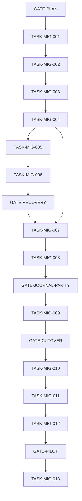

# HistGerm Curator Architecture Migration Plan

## 1. Status and authority

This plan converts the approved fit-for-purpose audit into implementation work
that GitHub Copilot executes autonomously. It authorizes neither automatic merge,
nor a real inventory sweep before `GATE-PILOT`, nor third-party payload retrieval.

The audit is the design authority:

- `C:\Users\daanv\.copilot\session-state\7fe1d855-ab16-4a21-ba72-3a90a95ff1ae\research\perform-an-independent-read-only-fit-for-purpose-a.md`

The prior autonomous draft is superseded by this corrected plan:

- `C:\Users\daanv\.copilot\session-state\7fe1d855-ab16-4a21-ba72-3a90a95ff1ae\research\histgerm-curator-autonomous-implementation-plan.md`

The target is **Design B**: native Copilot orchestration for research sequencing,
provider selection, retries, candidate quarantine, progress, and Git/PR
coordination; deterministic Python for typed records, evidence validation, a
compact append-only run journal, optimistic concurrency, atomic writes, inventory
validation, and publication gates.

## 2. Priority order

Every decision in this plan is ranked, highest first:

1. Metadata truth and evidence provenance.
2. Discovery effectiveness and recoverability.
3. Maintainability.
4. Operator effort.
5. Security as a low-cost baseline hygiene concern only.

Security-only controls never justify protocol complexity, whole-run termination,
or added operator burden. They remain only when inexpensive or when they also
protect evidence authenticity, repository cleanliness, or deterministic behavior.

## 3. Corrected execution model

- **One integration branch only:** `copilot/histgerm-curator-migration-<run-id>`.
- **One continuously updated draft migration pull request.** It is never merged,
  squash-merged, or auto-merged by this workflow; merging is out of scope and is
  not a gate.
- **Strict serialization.** `TASK-MIG-001` through `TASK-MIG-013` run one at a
  time on the integration branch. There are no execution waves and no
  implementation-task concurrency.
- **One conventional commit per task**, named for its task ID, on the integration
  branch.
- **Machine-only gates.** Task progression depends solely on machine-verifiable
  gate criteria and never on a reviewer, approval, or sign-off.
- **Durable machine state** in root `migration-state.json`.
- **Automatic rollback by commit revert**, never destructive reset.
- **Deterministic pilot selection** from the existing next-sweep command, recorded
  exactly once.

Serialization eliminates the conflicts the prior draft would have created by
running tasks in parallel:

- `src/histgerm/research/models.py` between `TASK-MIG-002` and `TASK-MIG-003`.
- `src/histgerm/research/discovery_protocol.py` between `TASK-MIG-004` and
  `TASK-MIG-006`.
- `src/histgerm/research/discovery_orchestration.py` between `TASK-MIG-003` and
  `TASK-MIG-009`.

## 4. Machine state: `migration-state.json`

### 4.1 Location and lifecycle

`migration-state.json` lives in the repository root. It is created when the
integration branch `copilot/histgerm-curator-migration-<run-id>` is created,
before `TASK-MIG-001` performs any edits. It is the single durable source of
truth for run identity, task status, commits, gate results, recorded checks,
generated-artifact hashes, and the pilot target.

### 4.2 Exact initial schema

The bootstrap content is exactly:

```json
{"schema_version":1,"plan_version":1,"run_id":"","branch":"","current_task":"TASK-MIG-001","tasks":{},"gates":{},"commits":{},"checks":{},"artifacts":{},"pilot_target":null}
```

On bootstrap, the coordinator fills `run_id` and `branch` with the concrete
run identifier and the integration branch name.

### 4.3 Task status values

Each entry in `tasks` uses exactly one of:

- `pending`
- `in_progress`
- `complete`
- `rolled_back`
- `failed`

### 4.4 Structure conventions

- `tasks`: maps each task ID (`TASK-MIG-001` … `TASK-MIG-013`) to its status.
- `gates`: maps each gate ID to its last machine evaluation (`pass`/`fail`) and
  the evidence used.
- `commits`: maps each task ID to its single commit hash on the integration
  branch.
- `checks`: maps each task ID to the recorded exit codes of the validation
  commands it ran.
- `artifacts`: maps generated-artifact names (for example the journal event JSON
  Schema or the query-intent registry snapshot) to content hashes.
- `pilot_target`: `null` until `GATE-PILOT`; then set exactly once (see §9).

A task or gate is complete only when its state entry, its commit (for tasks), and
all recorded checks are present and passing.

### 4.5 Distribution exclusion

`TASK-MIG-001` adds `migration-state.json` to `[tool.uv.build-backend]`
`source-exclude` in `pyproject.toml` so it can never enter a wheel or source
distribution. In the same edit, `TASK-MIG-001` adds exclusion globs for run
journal and checkpoint artifacts (for example `**/run-journal/**` and
`**/*.journal.jsonl`) alongside the existing ledger, vocabulary, browser-cache,
and fetched-page exclusions. The journal and checkpoints are operational
artifacts and must never ship in distributions.

## 5. Restart, interruption, and rollback

### 5.1 Restart procedure

A state migration may span multiple Copilot sessions. The plan never assumes one
session lasts through the entire migration. On startup the autonomous coordinator:

1. Reads `migration-state.json`.
2. Verifies the recorded `branch` exists and that repository `HEAD` matches the
   last recorded commit for the current task.
3. If `current_task` is `in_progress`, inspects that task's commit (if any) and
   its recorded checks.
4. Resumes the outstanding checks if the work is intact, or reverts the
   incomplete changes if they are partial or inconsistent.
5. Never silently restarts from `TASK-MIG-001`; it resumes from the recorded
   `current_task`.
6. Reuses the existing draft migration pull request rather than opening a new one.
7. If the pilot has begun, reuses the recorded pilot target and ledger revision
   from `pilot_target`; it never re-selects a pilot.

### 5.2 Rollback

Rollback is required when any of the following occur:

- trusted inventory validation changes unexpectedly;
- a migration silently accepts unsupported evidence;
- a journal replay differs from confirmed source events;
- a concurrent write is lost;
- a false sweep completion occurs;
- native orchestration cannot resume from durable state;
- a distribution includes journal or operational artifacts;
- a task changes files outside its declared scope.

Rollback is automatic and non-destructive. The coordinator independently reverts
the failing task's commit with a new revert commit, updates `migration-state.json`
(marking the task `rolled_back`), reruns the immediately preceding gate, and
continues only if that gate passes. `git reset --hard`, force-push, and other
destructive cleanup are prohibited. Each task commit is independently revertible.

## 6. Gates

Every gate is machine-verifiable. Because execution is strictly serialized, each
gate explicitly requires that **every** predecessor task is `complete`, even where
the semantic dependency graph is narrower.

### GATE-PLAN

**Blocks:** `TASK-MIG-001`.

**Machine-verifiable criteria:**

1. `plans/histgerm-curator-architecture-migration.md` exists in Git.
2. It contains the literals `GATE-PLAN`, `TASK-MIG-001`, and `TASK-MIG-013`.
3. `migration-state.json` exists in the repository root and parses against the
   initial schema in §4.2.
4. The integration branch is non-default and based on the current default-branch
   head.

### GATE-RECOVERY

**Blocks:** `TASK-MIG-007`. (`TASK-MIG-007` also depends directly on
`TASK-MIG-004`.)

**Predecessor tasks that must be `complete`:** `TASK-MIG-001`, `TASK-MIG-002`,
`TASK-MIG-003`, `TASK-MIG-004`, `TASK-MIG-005`, `TASK-MIG-006`. The gate
explicitly asserts `TASK-MIG-002`, `TASK-MIG-003`, `TASK-MIG-005`, and
`TASK-MIG-006`, and by serialization also requires `TASK-MIG-001` and
`TASK-MIG-004`.

**Additional criteria:**

- Evidence-grounding tests pass (unsupported stage, source-silence `out_of_scope`,
  identity ambiguity).
- One malformed sibling in a multi-candidate model response is retried or
  quarantined without discarding valid siblings.
- Missing inspection positions are recoverable via smaller-batch retry.
- Provider transport failures return structured `provider_gap` outcomes rather
  than aborting.
- Resume tests confirm no confirmed retrieval is repeated.
- `uv run pytest` and `uv run mypy src tests` pass with no new failures.

### GATE-JOURNAL-PARITY

**Blocks:** `TASK-MIG-009`.

**Predecessor tasks that must be `complete`:** `TASK-MIG-001` through
`TASK-MIG-008`. The gate explicitly asserts `TASK-MIG-004`, `TASK-MIG-007`, and
`TASK-MIG-008`, and by serialization also requires `TASK-MIG-001`, `TASK-MIG-002`,
`TASK-MIG-003`, `TASK-MIG-005`, and `TASK-MIG-006`.

**Additional criteria:**

- Journal replay is deterministic.
- Old-exchange and journal-replayed synthetic final results are equivalent.
- Interrupted runs resume without repeating confirmed retrievals.
- Optimistic-concurrency and atomicity tests pass.
- Full tests, lint, formatting, and typing pass.

### GATE-CUTOVER

**Blocks:** `TASK-MIG-010`.

**Predecessor tasks that must be `complete`:** `TASK-MIG-001` through
`TASK-MIG-009`. The gate explicitly asserts `TASK-MIG-009` and by serialization
requires all of `TASK-MIG-001` through `TASK-MIG-008`.

**Additional criteria:**

- Native bilingual and multi-channel workflow simulations pass.
- Publication validation consumes journal-derived results.
- No agent, skill, CLI, docs, or CI surface still requires an old-exchange symbol;
  a repository search finds no non-test caller of an old-exchange interface.
- Full tests, lint, formatting, and typing pass.

### GATE-PILOT

**Blocks:** `TASK-MIG-013`.

**Predecessor tasks that must be `complete`:** `TASK-MIG-001` through
`TASK-MIG-012` (explicitly enumerated).

**Additional criteria:**

- The synthetic canary targets in `TASK-MIG-012` pass.
- Full repository validation (§8) passes.
- The checked-in next-sweep selection command selects an incomplete sweep.
- The selected category, stage, sweep ID, and ledger revision are atomically
  recorded once in `migration-state.json`; no re-selection occurs (see §9).

## 7. Sequential task graph

Execution order (each gate is evaluated only from machine criteria):

1. `GATE-PLAN`
2. `TASK-MIG-001` — initialize machine state and capture precise baselines.
3. `TASK-MIG-002` — evidence-grounded stage, out-of-scope, and identity semantics.
4. `TASK-MIG-003` — canonical structured query intents.
5. `TASK-MIG-004` — shared durable persistence primitives.
6. `TASK-MIG-005` — candidate-local model-output recovery.
7. `TASK-MIG-006` — resumable protocol failures.
8. `GATE-RECOVERY`
9. `TASK-MIG-007` — typed run journal and CLI.
10. `TASK-MIG-008` — journal dual-write and parity.
11. `GATE-JOURNAL-PARITY`
12. `TASK-MIG-009` — native Copilot orchestration.
13. `GATE-CUTOVER`
14. `TASK-MIG-010` — retire the old exchange.
15. `TASK-MIG-011` — executable contracts and documentation.
16. `TASK-MIG-012` — synthetic canary.
17. `GATE-PILOT`
18. `TASK-MIG-013` — machine-selected real pilot and separate inventory PR.

Sequential dependencies: `TASK-MIG-001` is first (after `GATE-PLAN`);
`TASK-MIG-002` follows `TASK-MIG-001`; `TASK-MIG-003` is serialized after
`TASK-MIG-002`; `TASK-MIG-004` follows `TASK-MIG-003`; `TASK-MIG-005` follows
`TASK-MIG-004`; `TASK-MIG-006` follows `TASK-MIG-005`; `GATE-RECOVERY` follows
`TASK-MIG-006`; `TASK-MIG-007` follows `GATE-RECOVERY` (and depends on
`TASK-MIG-004`); `TASK-MIG-008` follows `TASK-MIG-007`; `GATE-JOURNAL-PARITY`
follows `TASK-MIG-008`; `TASK-MIG-009` follows `GATE-JOURNAL-PARITY`;
`GATE-CUTOVER` follows `TASK-MIG-009`; `TASK-MIG-010` follows `GATE-CUTOVER`;
`TASK-MIG-011` follows `TASK-MIG-010`; `TASK-MIG-012` follows `TASK-MIG-011`;
`GATE-PILOT` follows `TASK-MIG-012`; `TASK-MIG-013` follows `GATE-PILOT`.



## 8. Validation command set

The repository validation commands, using the repository's Windows path style for
path arguments:

```powershell
uv run python -m histgerm.research validate --ledger research\discovery-ledger.yaml --format json
uv run python -m histgerm.research vocabulary-validate --vocabulary research\discovery-vocabulary.yaml --format json
uv run python -m histgerm.validation src\histgerm\data
uv run pytest
uv run ruff check .
uv run ruff format --check .
uv run mypy src tests
uv build --no-sources
git diff --check
```

Implementation tasks must not change live ledger or vocabulary content while
running these checks. Each task runs the smallest targeted subset first, then the
gate's required checks; full-suite runs are reserved for gates that require them.

## 9. Pilot target selection (recorded exactly once)

After `GATE-PILOT` passes, the coordinator selects the pilot target exactly once
using the existing command:

```powershell
uv run python -m histgerm.research next
```

The coordinator atomically stores the selected `category`, `stage`, sweep ID, and
ledger revision in `pilot_target` within `migration-state.json`. It never
re-selects, and on any later resume it reuses the recorded target and revision.
The pilot runs on a normal unique inventory branch (not the integration branch)
and opens a separate inventory pull request. Neither the migration PR nor the
pilot inventory PR is ever merged by this workflow.

## 10. Authoritative per-task suffix

Every task ends with this single authoritative instruction. It supersedes any
per-task branch, separate-PR, schema-review, or approval sentence:

> Continue on `copilot/histgerm-curator-migration-<run-id>`. Run the task's
> targeted checks. If they pass, create one conventional commit whose message
> contains the task ID, update `migration-state.json`, push the integration
> branch, and update the single draft migration pull request. Evaluate the next
> machine gate and, when it passes, proceed automatically to the next task without
> pausing for approval or sign-off.

## 11. Task packets

Each packet lists its declared file scope. A task must not modify files outside
its scope. Every task also runs the applicable validation commands from §8 and
appends its recorded checks to `migration-state.json`.

### TASK-MIG-001 — Initialize machine state and capture baselines

- **Status:** pending
- **Depends on:** `GATE-PLAN`
- **Risk:** low

**Scope**

- `migration-state.json` (root, **tracked in Git**; the single durable source of
  truth is committed and pushed on the integration branch so runs resume across
  sessions and via the draft PR)
- `pyproject.toml` (add `migration-state.json`, run-journal, and checkpoint globs
  to `[tool.uv.build-backend]` `source-exclude`)
- `tests/test_wheel.py` (narrowly permit only the exact root
  `migration-state.json` under the repository payload rule; keep archive safety
  rejecting JSON and add distribution assertions confirming the file is absent
  from the wheel and sdist)
- `tests/research/fixtures/`
- `tests/research/test_migration_baseline.py`
- `plans/histgerm-curator-architecture-migration.md` (this scope/acceptance
  correction, recorded during the non-destructive rollback/retry of this task so
  no coupled edit stays hidden)

**Work**

1. Confirm `migration-state.json` exists (created with branch bootstrap), **track
   it in Git**, and add it plus the journal/checkpoint artifact globs to the build
   source exclusions so the tracked state never enters a wheel or sdist. Narrowly
   update `tests/test_wheel.py` so the repository payload rule permits only the
   exact root `migration-state.json` while all other JSON payloads stay rejected.
2. Add minimal synthetic checkpoint, exchange, ledger, vocabulary, model-output,
   and provider-response fixtures that parse with the current checked-in models.
3. Record precise baselines into `migration-state.json` `artifacts`/`checks`:
   - **Exact combined source line count of
     `src/histgerm/research/discovery_protocol.py` and
     `src/histgerm/research/discovery_session.py`.** This combined count is the
     sole denominator for the `TASK-MIG-010` code-reduction target.
   - Total line count under `src/histgerm/research` (informational only; not a
     target denominator).
   - **Exact count of behavioral phrase-presence assertions under `tests/agent/`
     only.** This count is the sole denominator for the `TASK-MIG-011`
     phrase-test-reduction target.
   - Targeted research-test wall-clock duration.
   - Current synthetic whole-run abort and recovery counts.

**Acceptance**

- All new fixtures parse using current models.
- `migration-state.json` is tracked in Git as the single durable source of truth,
  committed and pushed on the integration branch, yet remains excluded from the
  wheel and sdist and is verified absent from both.
- `tests/test_wheel.py` permits only the exact root `migration-state.json` as a
  repository payload, still rejects every other JSON payload for archive safety,
  and its distribution tests confirm `migration-state.json` is absent from the
  wheel and sdist.
- No production behavior changes; the only non-test edits are the `pyproject.toml`
  exclusion additions and the tracked `migration-state.json` machine state.
- Baseline denominators are recorded in `migration-state.json`.

**Stop conditions**

- A fixture needs network access, absolute paths, secrets, or live mutable state.

### TASK-MIG-002 — Evidence-grounded dispositions

- **Status:** pending
- **Depends on:** `TASK-MIG-001`
- **Risk:** medium

**Scope**

- `src/histgerm/research/models.py`
- `tests/research/test_models.py`
- directly related fixtures

**Work**

1. Require every `verified_stage` in an `added` result to have matching canonical
   evidence, using the existing `EvidenceExcerpt.supports` dotted-support
   convention (not the trusted `Source` model directly).
2. Require identity ambiguity to carry `identity_conflict` and prevent `added`.
3. Preserve the existing legal-evidence validator unchanged.
4. Implement changes as **validators only**. Do not add any new required
   constructor field or public domain field/enum to exported research models.
5. Return precise Pydantic diagnostics suitable for candidate-local blocking.

**Already satisfied — regression only**

The current model already requires affirmative evidence for `out_of_scope`;
source silence cannot yield `out_of_scope`. Do **not** list this as new production
implementation work. Retain or add a regression test asserting that a candidate
with no stage evidence becomes `blocked`, never `out_of_scope`.

**Acceptance**

- Unsupported stage claims fail validation.
- Source silence cannot produce `out_of_scope` (regression test present).
- Identity ambiguity cannot produce `added`.
- Existing valid inventory and worker-result fixtures remain valid.
- No new required constructor fields on exported models.

**Stop conditions**

- The change would require a new public field/enum or a live-YAML migration.

### TASK-MIG-003 — Canonical structured query intents

- **Status:** pending
- **Depends on:** `TASK-MIG-002`
- **Risk:** high

**Scope**

- new `src/histgerm/research/query_intents.py`
- `src/histgerm/research/models.py`
- `src/histgerm/research/focused_queries.py`
- `src/histgerm/research/discovery_orchestration.py`
- targeted query and model tests

**Work**

1. Define `QueryIntent` and one canonical stage/category/concept/channel registry.
2. Make focused-query generation emit intent IDs.
3. Make the search-query record reference an intent ID while retaining authored
   query text.
4. Validate completed-pass coverage from typed intent records rather than
   substrings.
5. Preserve read compatibility with existing ledger records; add a migration
   adapter only at the load boundary and do not dual-maintain registries.
6. Preserve existing query behavior for callers that do not opt into intents.
7. Prove a term-stuffed query cannot satisfy multiple intents.

**Acceptance**

- One canonical registry exists; the existing ledger validates without mutation.
- New pass validation uses structured intent coverage.
- Focused bilingual query tests pass; existing query behavior is preserved.
- A term-stuffing fixture fails completion.
- The registry schema, coverage matrix, compatibility result, and term-stuffing
  outcome are hashed into `migration-state.json`.

**Stop conditions**

- Ledger compatibility would require rewriting live repository state, or the
  registry introduces discovery policy not approved by the audit.

### TASK-MIG-004 — Shared durable persistence primitives

- **Status:** pending
- **Depends on:** `TASK-MIG-003`
- **Risk:** medium

**Scope**

- new private persistence module under `src/histgerm/research/`
- `src/histgerm/research/ledger.py`
- `src/histgerm/research/vocabulary_store.py`
- `src/histgerm/research/discovery_protocol.py`
- persistence tests

**Work**

1. Extract same-directory temporary write, flush, `fsync`, atomic replace,
   cleanup, and bounded lock acquisition into one private utility.
2. Preserve the ledger's OS lock and revision semantics.
3. Give vocabulary locking explicit stale-owner handling without unsafe automatic
   deletion.
4. Add `fsync` to checkpoint writes through the shared utility.
5. Do not change any serialized format, exception type, or CLI exit code.

**Acceptance**

- Atomic-failure tests leave prior content intact.
- Cross-process ledger and vocabulary contention detects stale revisions without
  lost updates.
- Checkpoint round-trip and permissions are unchanged.
- No canonical ledger or vocabulary serialization diff.

**Stop conditions**

- Cross-platform lock behavior cannot be proven, or refactoring changes public
  exceptions or CLI exit codes.

### TASK-MIG-005 — Candidate-local model-output recovery

- **Status:** pending
- **Depends on:** `TASK-MIG-004`
- **Risk:** medium

**Scope**

- `src/histgerm/research/elicitation.py`
- related model/session integration
- targeted elicitation and worker-result tests

**Work**

1. Parse elicited candidates independently.
2. Retain valid candidates when one candidate is malformed.
3. Retry invalid response formatting once with schema feedback.
4. Truncate safe count-limit excess with a warning.
5. After retry exhaustion, create candidate-local blocked/quarantined findings.
6. Record retry and quarantine metrics.

**Acceptance**

- One malformed candidate does not remove valid siblings.
- Invalid JSON recovers on the second valid response.
- Repeated invalid output becomes a scoped block.
- No invented fields or success-shaped fallbacks.

**Stop conditions**

- Recovery would require accepting partially validated trusted records.

### TASK-MIG-006 — Resumable protocol failures

- **Status:** pending
- **Depends on:** `TASK-MIG-005`
- **Risk:** high

**Scope**

- `src/histgerm/research/discovery_session.py`
- `src/histgerm/research/discovery_protocol.py`
- `src/histgerm/research/discovery_runtime.py`
- session/protocol tests

**Work**

1. Keep fatal handling for wrong run ID, parameter digest, duplicate positions,
   and non-pending responses.
2. Treat missing positions and malformed response formatting as retryable.
3. On stale checkpoint revision, return the current pending actions and expected
   revision instead of discarding the run.
4. Split large inspection retries into smaller batches.
5. Turn provider transport failures into `provider_gap` events/results.
6. Preserve checkpoint state after every recoverable failure.

**Acceptance**

- Missing positions recover without restarting.
- Stale responses receive actionable current-state output.
- Wrong run identity remains fatal.
- Confirmed retrievals are not repeated on resume.
- Provider gaps do not abort other channels.

**Stop conditions**

- A proposed recovery could apply a response to the wrong item or run.

### TASK-MIG-007 — Typed run journal and CLI

- **Status:** pending
- **Depends on:** `GATE-RECOVERY` (and directly on `TASK-MIG-004`)
- **Risk:** high

**Scope**

- new journal model/store modules under `src/histgerm/research/`
- `src/histgerm/research/__main__.py` (journal validate/append/status/compact
  subcommands)
- journal tests

**Work**

1. Implement the fixed append-only event schema with discriminated payloads
   (`run_started`, `query_planned`, `query_executed`, `provider_gap`,
   `lead_found`, `model_response_invalid`, `retry_scheduled`, `candidate_blocked`,
   `candidate_researched`, `ledger_revision_observed`, `ledger_mutation_proposed`,
   `checkpoint`, `run_completed`). Each event carries `schema_version`, `run_id`,
   `sequence`, `recorded_at`, `kind`, and `payload`.
2. Add atomic idempotent append keyed by `(run_id, sequence)` using the shared
   persistence utility from `TASK-MIG-004`.
3. Add compact checkpoint snapshots that retain a journal content hash and last
   sequence.
4. Reject sequence gaps, duplicate events with differing content, and wrong run
   IDs.
5. Expose JSON-only CLI subcommands in `src/histgerm/research/__main__.py`.
6. Keep journal paths outside trusted inventory data and distributions (already
   excluded by `TASK-MIG-001`).

**Acceptance**

- Replay is deterministic.
- Duplicate identical append is idempotent; conflicting duplicate append fails.
- Interrupted append leaves the prior journal valid.
- Each CLI command emits exactly one JSON object.
- The generated event JSON Schema is stored as a test artifact and hashed in
  `migration-state.json`.

**Stop conditions**

- The journal cannot be kept out of trusted inventory data or distributions.

### TASK-MIG-008 — Journal dual-write and parity

- **Status:** pending
- **Depends on:** `TASK-MIG-007`
- **Risk:** high

**Scope**

- discovery orchestration/session journal integration
  (`src/histgerm/research/discovery_orchestration.py`,
  `src/histgerm/research/discovery_session.py`)
- journal adapters
- parity tests

**Work**

1. Emit journal events for queries, provider gaps, model responses, leads,
   candidate states, revisions, and checkpoints while the old exchange remains the
   execution authority.
2. Do not change current final results.
3. Add replay that reconstructs the proposed `DiscoveryRunResult`.
4. Compare old-path and journal-replayed results in synthetic tests.
5. Record mismatches as test failures, never runtime fallbacks.

**Acceptance**

- Synthetic old-path and replayed outputs are semantically identical.
- Journal replay repeats no retrieval.
- Existing protocol tests remain green.
- No live-state changes.

**Stop conditions**

- Parity would require weakening validation or dropping recorded information.

### TASK-MIG-009 — Native Copilot orchestration

- **Status:** pending
- **Depends on:** `GATE-JOURNAL-PARITY`
- **Risk:** high

**Scope**

- `.github/agents/histgerm-inventory-curator.agent.md`
- `.github/skills/discover-histgerm-resources/SKILL.md`
- `.github/skills/curate-histgerm-resource/SKILL.md`
- `.github/skills/validate-histgerm-inventory/SKILL.md`
- `.github/skills/publish-histgerm-batch/SKILL.md`
- `src/histgerm/research/__main__.py` (minimal CLI adapters required by skills;
  the `TASK-MIG-007` journal subcommands already satisfy the migrated skills, so
  no new adapter was required and the legacy `discover` exchange branch is
  retained unchanged for `TASK-MIG-010`)
- `docs/inventory-curator.md` (the operator guide is a contract surface enforced
  by `tests/agent/`, and `GATE-CUTOVER` requires that no docs surface still
  requires an old-exchange symbol; its required old-exchange operator flow is
  migrated to the journal here while the broader documentation restructuring
  stays with `TASK-MIG-011`)
- `tests/agent/` (executable workflow simulations)

**Work**

1. Replace checkpoint/exchange instructions with journal append/status/resume
   instructions across the agent and the four skills.
2. Let native orchestration choose query order, provider fallback, retries, and
   worker batches.
3. Require every external result to become a typed journal event.
4. Keep worker outputs validated as `CandidateResearchResult`.
5. Keep coordinator-only trusted writes and optimistic concurrency.
6. Record the model identifier used; remove the exact-model hard-stop requirement.
7. Preserve the `TASK-MIG-003` query-intent behavior end to end.
8. Add native bilingual and multi-channel workflow simulations under `tests/agent/`
   that validate output shapes and command sequencing rather than wording.
9. Review the agent frontmatter `disable-model-invocation: true` and document its
   platform meaning. Change it only if the executable workflow simulations prove
   it blocks the target native orchestration; otherwise leave it unchanged.

**Acceptance**

- The synthetic full discovery flow completes through native orchestration.
- Recovery resumes from journal state.
- Candidate-local blocks do not stop unrelated work.
- No old-exchange command is required by the agent or skills.

**Stop conditions**

- Native orchestration cannot complete a synthetic flow without the old exchange.

### TASK-MIG-010 — Retire the old exchange

- **Status:** pending
- **Depends on:** `GATE-CUTOVER`
- **Risk:** high

**Scope**

- old exchange/checkpoint symbols in `src/histgerm/research/`
- CLI branches used only by the old protocol in `src/histgerm/research/__main__.py`
- obsolete tests and docs

**Work**

1. Identify symbols reachable only from the old exchange.
2. Delete them and their tests.
3. Retain the shared atomic-store and journal utilities.
4. Remove compatibility adapters introduced for cutover.
5. Confirm no agent, skill, docs, or CI command references deleted interfaces.

**Acceptance**

- No old-exchange request/response symbols remain.
- The journal/native synthetic flow remains green.
- The combined line count of `discovery_protocol.py` and `discovery_session.py`
  is at least **25% lower** than the exact combined baseline recorded by
  `TASK-MIG-001`.
- Full validation passes.

**Stop conditions**

- A supposedly obsolete symbol still has a non-test caller, or deletion would
  reduce recorded provenance or recovery behavior.

### TASK-MIG-011 — Executable contracts and documentation

- **Status:** pending
- **Depends on:** `TASK-MIG-010`
- **Risk:** medium

**Scope**

- `tests/agent/`
- curator documentation
- agent/skill documentation
- this plan's completion status

**Work**

1. Retain exact tests only for frontmatter, skill inventory, JSON output schemas,
   and prohibited publication actions.
2. Replace behavioral phrase assertions with executable simulations or typed
   fixture validation.
3. Document the journal, failure taxonomy, recovery, query intents, and operator
   resume flow.
4. Reframe security as a low-cost baseline hygiene concern.
5. Document model provenance rather than exact-model pinning.

**Acceptance**

- The behavioral phrase-presence assertion count under `tests/agent/` is at least
  **50% lower** than the exact `tests/agent/` baseline recorded by
  `TASK-MIG-001`.
- Every retained exact assertion has a comment explaining why its wording is
  contractual.
- Documentation contains no old-exchange instructions.
- Full validation passes.

**Stop conditions**

- A retained wording assertion cannot be justified as a true textual contract.

### TASK-MIG-012 — Synthetic canary

- **Status:** pending
- **Depends on:** `TASK-MIG-011`
- **Risk:** medium

**Scope**

- synthetic fault suite under `tests/`
- a metrics report generated as test output or PR description
- no production logic except fixes exposed directly by the canary

**Scenarios**

1. Invalid JSON then valid retry.
2. One malformed candidate among valid siblings.
3. Missing inspection positions.
4. Stale journal/checkpoint sequence.
5. Provider 429, timeout, challenge, and unrelated results.
6. Candidate lacking stage evidence.
7. Candidate with ambiguous identity.
8. Concurrent ledger and vocabulary updates.
9. Interrupted journal append.
10. Full bilingual multi-channel empty pass.

**Targets (asserted by tests)**

- Recoverable failures resume without restart: at least 95%.
- Whole-run aborts: under 5%, only integrity cases.
- False completion: 0%.
- Candidate quarantine after exhausted retries: 100%.
- Optimistic-concurrency contention detection: 100%.
- Legal and stage evidence rejection: 100%.

**Acceptance**

- Targets are asserted by tests, not manually reported.
- No network access.
- Full validation passes.
- Any production fix is made only when the canary exposes the specific defect.

**Stop conditions**

- A target fails for a reason outside the migrated code's responsibility.

### TASK-MIG-013 — Machine-selected real pilot

- **Status:** pending
- **Depends on:** `GATE-PILOT`
- **Branch:** normal unique inventory branch (not the integration branch)
- **Risk:** high

**Rules**

- Use the pilot target already recorded once in `migration-state.json` (§9); never
  re-select.
- Use the curator skills, not implementation-task prompts.
- Run on a normal unique inventory branch and open a **separate** inventory pull
  request. This is a pilot only; never merge either pull request.
- Stop after one sweep/canary batch.

**Reports**

- query intents completed
- provider gaps
- candidates found
- candidates blocked
- recoveries without restart
- operator interventions
- schema-invalid candidates
- evidence-grounding failures

**Acceptance**

- No metadata-truth regression.
- Recovery and abort targets remain met.
- Every proposed trusted field passes deterministic evidence validation.
- Candidate yield, blocking rate, and provider-gap rate are recorded against the
  accepted baseline.

## 12. Operator launch procedure

1. Land this plan at `plans/histgerm-curator-architecture-migration.md` and the
   single autonomous launch entry in `TODO.md`.
2. Launch Copilot once with the autonomous migration launch prompt in `TODO.md`.
3. Copilot creates the integration branch `copilot/histgerm-curator-migration-<run-id>`,
   bootstraps `migration-state.json`, and opens one draft migration PR.
4. Copilot executes `TASK-MIG-001` through `TASK-MIG-013` strictly in order, one
   commit per task, updating `migration-state.json` and the single draft PR after
   each task, and evaluating every gate from machine criteria only.
5. Copilot stops only on a failed machine gate, a rollback trigger, or an
   unresolved contradiction.
6. After `GATE-PILOT`, Copilot records one pilot target with the next-sweep
   command, runs the pilot on a unique inventory branch, and opens a separate
   inventory PR.
7. The migration PR and the pilot inventory PR remain open; their merge state does
   not control task progression and is out of scope for this workflow.

## 13. Completion checklist

- [x] `TASK-MIG-001` baseline committed on the integration branch
- [x] `TASK-MIG-002` evidence semantics committed on the integration branch
- [x] `TASK-MIG-003` structured query intents committed on the integration branch
- [x] `TASK-MIG-004` persistence utilities committed on the integration branch
- [x] `TASK-MIG-005` model-output recovery committed on the integration branch
- [x] `TASK-MIG-006` protocol recovery committed on the integration branch
- [x] `GATE-RECOVERY` criteria satisfied (machine-verified)
- [x] `TASK-MIG-007` journal schema/store/CLI committed on the integration branch
- [x] `TASK-MIG-008` dual-write parity committed on the integration branch
- [x] `GATE-JOURNAL-PARITY` criteria satisfied (machine-verified)
- [x] `TASK-MIG-009` native orchestration committed on the integration branch
- [x] `GATE-CUTOVER` criteria satisfied (machine-verified)
- [x] `TASK-MIG-010` old exchange retired, committed on the integration branch
- [x] `TASK-MIG-011` contracts/docs committed on the integration branch
- [x] `TASK-MIG-012` synthetic canary committed on the integration branch
- [x] `GATE-PILOT` criteria satisfied (machine-verified)
- [x] `TASK-MIG-013` real pilot run on a unique inventory branch with a separate PR
- [x] Final architecture acceptance recorded in `migration-state.json`

## 14. Plan acceptance and self-check

Before this plan is treated as executable, confirm all of the following:

1. **No prohibited patterns.** The plan contains no per-task branch, no separate
   task PR, no task-merge dependency, no parallel execution wave, and none of the
   phrases that denote a non-machine gate, reviewer approval, or approval-driven
   sign-off. A text search finds none of the disallowed gate phrases.
2. **Single branch and single draft PR.** Exactly one integration branch and one
   continuously updated draft migration PR; neither is merged by this workflow.
3. **Complete gate dependencies.** Every task dependency is represented in its
   blocking gate, and each gate explicitly asserts every predecessor task by
   serialization.
4. **Complete scopes.** Every file a task must modify is listed in that task's
   scope, including `src/histgerm/research/__main__.py`, all five curator
   agent/skill files, and `tests/agent/`.
5. **Precise denominators.** The code-reduction target names the exact combined
   `discovery_protocol.py` + `discovery_session.py` baseline; the phrase-test
   target names the exact `tests/agent/` baseline; both are captured in
   `TASK-MIG-001`.
6. **Machine state and resume.** `migration-state.json` creation, schema, source
   exclusion, restart, and rollback semantics are defined, and the launch prompt
   can resume from machine state across sessions.
7. **Pilot recorded once.** The pilot target is selected once with the next-sweep
   command, stored atomically, and never re-selected.
8. **Clean diff.** `git diff --check` passes on the planning-artifact changes.
